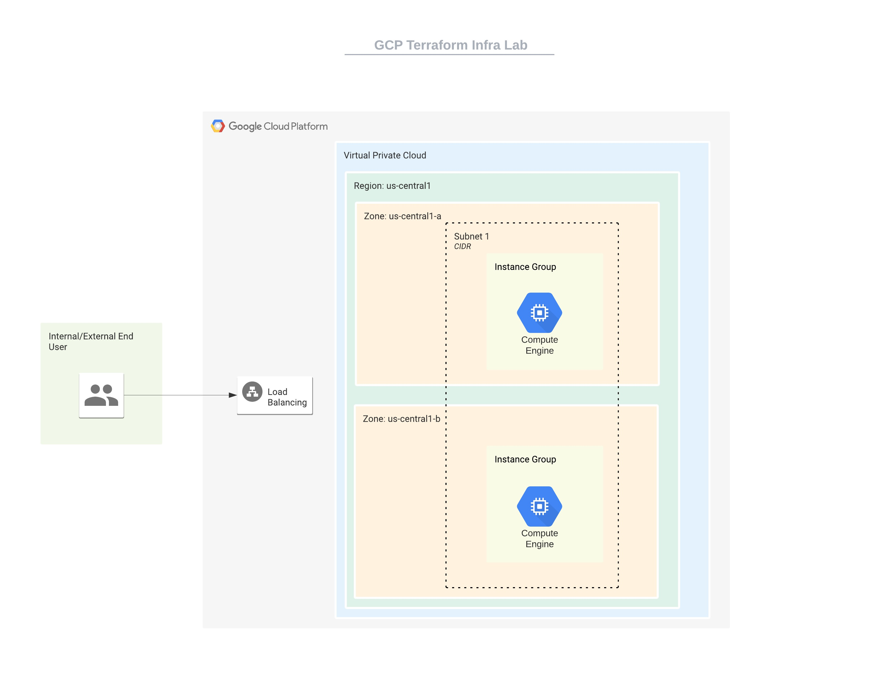

# GCP Lab
## Http LB with Instance Template & Instance Group

### Diagram & Resources



we will setting up: 
* virtual network
* subnet and fw rules
* define region and az
* healthcheck & static_ip
* define the LB (BE & FE components)
* instance template
* instance group

### Usage

1. Clone the project
2. Define your variables or `terraform.tfvars`
3. execute the basic terraform commands to `init`, `plan` & `apply` the changes.
```terraform
terraform init
terraform plan
terraform apply
```
